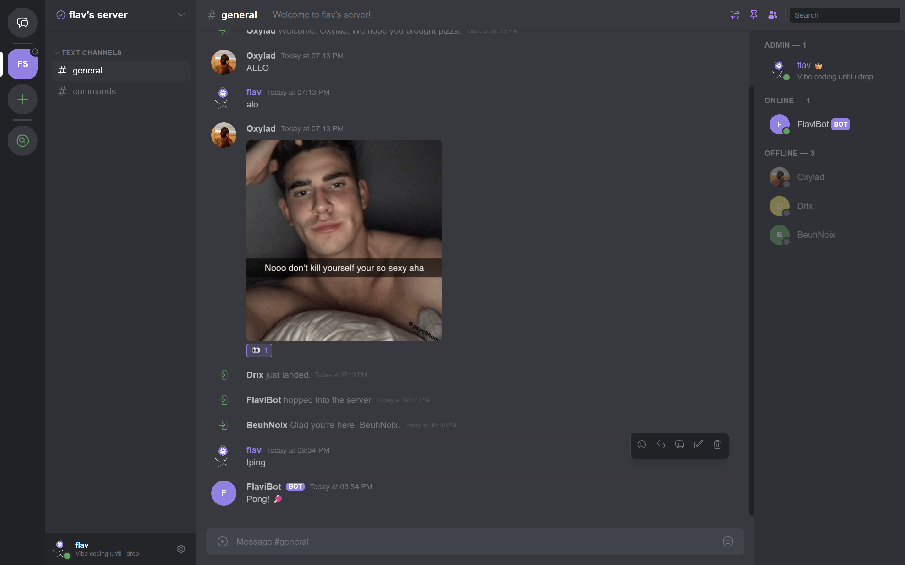

# My Discord

A full-featured Discord clone built with [SpacetimeDB](https://spacetimedb.com) (Rust) and [Nuxt 4](https://nuxt.com) (Vue 3).

SpacetimeDB replaces both the database and the backend — clients connect via WebSocket and receive real-time table updates. Mutations go through server-side reducers. Message history is served via a REST API (Fastify).

**Live:** [chat.flavi.dev](https://chat.flavi.dev)



## Features

- **Servers & Channels** — create servers, text channels, categories, reorder via drag & drop
- **Direct Messages** — 1:1 and group DMs
- **Threads** — threaded conversations within channels
- **Reactions** — Unicode and custom emoji reactions
- **Roles & Permissions** — bitflag RBAC with 11 permissions, hoisted roles, role colors
- **Custom Emojis** — upload per-server, use in messages, reactions, and status
- **Markdown** — bold, italic, strikethrough, code blocks, spoilers, links
- **File Uploads** — images, videos, documents up to 25MB (Backblaze B2 CDN)
- **Message Features** — edit, delete, pin, reply with connector line, search
- **Friends System** — send/accept/decline requests, block/unblock users
- **Invites** — shareable invite links with max uses
- **Server Discovery** — browse and join public servers
- **Bots** — bot accounts with token auth, auto-join servers
- **Badges** — staff, early adopter, server owner, bug hunter, contributor, partner
- **Presence** — online/idle/DND/invisible status, typing indicators, auto-idle after 10min
- **Multi-Device** — identity linking for account recovery across devices
- **Notifications** — sound + desktop notifications with membership checks
- **Keyboard Shortcuts** — Ctrl+K quick switcher, Escape, Ctrl+Shift+M

## Architecture

```
Browser
  ├── https://chat.flavi.dev       → nginx → Nuxt (Docker, port 3022)
  ├── wss://chat.flavi.dev/v1/     → nginx → SpacetimeDB WS (Docker, port 3020)
  └── https://chat.flavi.dev/api/  → nginx → API service (Docker, port 3025)

CDN: https://cdn-chat.flavi.dev    → Backblaze B2
```

| Component | Stack |
|-----------|-------|
| Backend | SpacetimeDB 2.0 (Rust module — tables, reducers, views) |
| Frontend | Nuxt 4 / Vue 3 SPA, Nuxt UI, SpacetimeDB SDK v2 |
| API | Fastify (message history, file uploads, search) |
| Bot | Node.js + SpacetimeDB SDK |
| Storage | Backblaze B2 (images compressed via sharp, WebP) |
| Deploy | Docker Compose (4 services) |

## Quick Start

### Prerequisites

- Docker & Docker Compose
- Node.js 22+
- Rust (for SpacetimeDB module compilation)

### Setup

```bash
# 1. Clone
git clone https://github.com/flav-code/my-discord.git
cd my-discord

# 2. Configure environment
cp api/.env.example api/.env        # Add your Backblaze B2 credentials
cp bot/.env.example bot/.env        # Configure bot (optional)
cp .env.publish.example .env.publish # Add SpacetimeDB admin token

# 3. Start SpacetimeDB
docker compose up -d spacetimedb

# 4. Publish the Rust module
bash scripts/publish-module.sh

# 5. Generate TypeScript bindings
bash scripts/generate-bindings.sh

# 6. Start the frontend (dev)
cd client && npm install && npm run dev

# 7. Start the API service
cd api && npm install && npx tsx index.ts
```

### Production

```bash
# Build and deploy everything
bash scripts/deploy.sh

# Or manually
docker compose build && docker compose up -d
```

### Ports

| Service | Port |
|---------|------|
| SpacetimeDB | 3020 |
| Nuxt dev | 3021 |
| Nuxt prod | 3022 |
| API service | 3025 |

## Backup & Restore

Automated hourly backups with 30-day retention (includes data, ECDSA keys, and admin token):

```bash
# Manual backup
bash scripts/backup-db.sh

# List backups
bash scripts/restore-db.sh --list

# Restore from backup
bash scripts/restore-db.sh scripts/backups/stdb-XXXXXXXX-XXXXXX.tar.gz

# Restore latest
bash scripts/restore-db.sh --latest
```

## Security

- REST API authenticated via SpacetimeDB JWT tokens
- Membership verification on all message endpoints
- SQL injection prevention (BigInt validation)
- Password hashing with per-user salt (100k rounds, 256-bit)
- Rate limiting on messages, reactions, DMs, and account recovery
- SVG uploads blocked (XSS prevention)
- CORS restricted to allowed origins
- Private tables for auth data, bot tokens, and rate limits

## License

MIT
